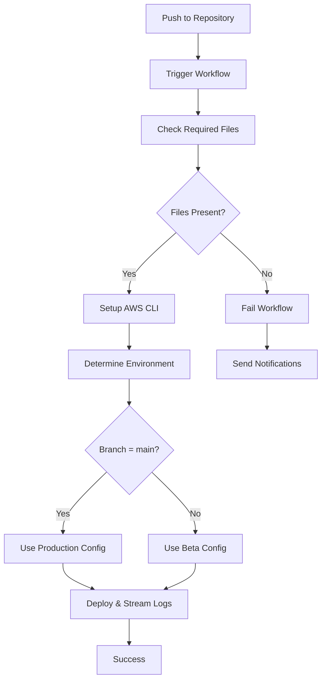

# GitHub Actions Deployment Workflow

This repository contains a GitHub Actions workflow that automates deployment processes with file validation, AWS integration, and environment-specific configurations for both beta and production environments.

## Table of Contents
- [GitHub Secrets Configuration](#github-secrets-configuration)
- [File Presence Check](#file-presence-check)
- [AWS CLI Integration](#aws-cli-integration)
- [CloudWatch Logging](#cloudwatch-logging)
- [Error Handling](#error-handling)
- [Troubleshooting](#troubleshooting)

## GitHub Secrets Configuration

The workflow requires several GitHub Secrets to be configured in your repository settings. Navigate to **Settings > Secrets and variables > Actions** to add these secrets:

### Required Secrets

| Secret Name | Description | Example Value |
|-------------|-------------|---------------|
| `AWS_ACCESS_KEY_ID` | AWS access key for authentication | `AKIA...` |
| `AWS_SECRET_ACCESS_KEY` | AWS secret access key | `wJalr...` |
| `AWS_REGION` | AWS region for resources | `us-east-1` |
| `BETA_LOG_GROUP` | CloudWatch log group for beta environment | `/aws/lambda/beta-app` |
| `PROD_LOG_GROUP` | CloudWatch log group for production environment | `/aws/lambda/prod-app` |

### How to Add GitHub Secrets

1. Go to your repository on GitHub
2. Click on **Settings** tab
3. In the left sidebar, click **Secrets and variables** > **Actions**
4. Click **New repository secret**
5. Enter the secret name and value
6. Click **Add secret**

### Environment-Specific Secrets (Optional)

You can also configure environment-specific secrets by creating environments:

1. Go to **Settings** > **Environments**
2. Create `beta` and `production` environments
3. Add environment-specific secrets and variables

## File Presence Check

The workflow includes a mandatory file validation step that ensures all required files are present before proceeding with deployment.

### Required Files

The following files must be present in your repository:
- `package.json` - Project configuration and dependencies
- `.gitignore` - File exclusion patterns
- `README.md` - Project documentation

### Running File Presence Check Manually

You can run the file presence check manually using several methods:

#### Method 1: Using GitHub CLI
```bash
# Trigger the workflow manually
gh workflow run deploy.yml

# Check workflow status
gh run list --workflow=deploy.yml
```

#### Method 2: Via GitHub Web Interface
1. Go to the **Actions** tab in your repository
2. Select the deployment workflow
3. Click **Run workflow**
4. Choose the branch and click **Run workflow**

#### Method 3: Local Script
Create a local script to check files:

```bash
#!/bin/bash
# check-files.sh

required_files=(".gitignore" "README.md")
missing_files=()

echo "Checking for required files..."

for file in "${required_files[@]}"; do
    if [ ! -f "$file" ]; then
        missing_files+=("$file")
        echo "Missing: $file"
    else
        echo "Found: $file"
    fi
done

if [ ${#missing_files[@]} -eq 0 ]; then
    echo "All required files are present!"
    exit 0
else
    echo "Missing ${#missing_files[@]} required file(s)"
    exit 1
fi
```

Run with: `chmod +x check-files.sh && ./check-files.sh`

## AWS CLI Integration

The workflow uses AWS CLI for various deployment and logging operations.

### AWS CLI Log Step

The AWS CLI log step performs the following operations:

1. **Authentication**: Uses the configured AWS credentials from GitHub Secrets
2. **Log Streaming**: Connects to CloudWatch Logs to stream real-time deployment logs
3. **Environment Detection**: Automatically determines whether to use beta or production log groups based on the branch
4. **Log Filtering**: Filters logs to show only relevant deployment information

### How It Works

```yaml
- name: Stream AWS Logs
  run: |
    # Determine log group based on environment
    if [[ "${{ github.ref }}" == "refs/heads/main" ]]; then
      LOG_GROUP="${{ secrets.PROD_LOG_GROUP }}"
      ENV="production"
    else
      LOG_GROUP="${{ secrets.BETA_LOG_GROUP }}"
      ENV="beta"
    fi
    
    echo "Streaming logs from $ENV environment..."
    echo "Log Group: $LOG_GROUP"
    
    # Stream recent logs
    aws logs tail $LOG_GROUP --since 1h --follow
```

### AWS CLI Commands Used

- `aws logs tail` - Stream real-time logs from CloudWatch
- `aws logs describe-log-groups` - Verify log group existence
- `aws logs filter-log-events` - Filter specific log events

## CloudWatch Logging

### Log Locations

#### Beta Environment
- **Log Group**: Value stored in `BETA_LOG_GROUP` secret
- **Typical Path**: `/aws/lambda/beta-app` or `/aws/ecs/beta-cluster`
- **Access**: AWS Console > CloudWatch > Log groups > [BETA_LOG_GROUP]

#### Production Environment
- **Log Group**: Value stored in `PROD_LOG_GROUP` secret
- **Typical Path**: `/aws/lambda/prod-app` or `/aws/ecs/prod-cluster`
- **Access**: AWS Console > CloudWatch > Log groups > [PROD_LOG_GROUP]

### Finding Logs in CloudWatch

1. **Via AWS Console**:
   - Open [AWS CloudWatch Console](https://console.aws.amazon.com/cloudwatch/)
   - Navigate to **Logs** > **Log groups**
   - Find your log group (beta or prod)
   - Click on log group to view log streams
   - Select the most recent log stream

2. **Via AWS CLI**:
   ```bash
   # List log groups
   aws logs describe-log-groups
   
   # Get recent logs for beta
   aws logs tail /aws/lambda/beta-app --since 1h
   
   # Get recent logs for production
   aws logs tail /aws/lambda/prod-app --since 1h
   
   # Filter logs by keyword
   aws logs filter-log-events --log-group-name /aws/lambda/prod-app --filter-pattern "ERROR"
   ```

3. **Direct Links**:
   - Beta: `https://console.aws.amazon.com/cloudwatch/home?region=us-east-1#logsV2:log-groups/log-group/[BETA_LOG_GROUP]`
   - Prod: `https://console.aws.amazon.com/cloudwatch/home?region=us-east-1#logsV2:log-groups/log-group/[PROD_LOG_GROUP]`

### Log Retention and Costs

- Check your log retention settings in CloudWatch to manage costs
- Consider setting up log retention policies (7 days, 30 days, etc.)
- Monitor CloudWatch costs in AWS Billing dashboard

## Error Handling

### What Happens When Required Files Are Missing

When the file presence check detects missing required files:

1. **Immediate Failure**: The workflow stops at the file check step
2. **Error Logging**: Detailed error message shows which files are missing
3. **No Deployment**: Subsequent deployment steps are skipped
4. **GitHub Status**: The workflow run is marked as failed
5. **Notifications**: Team members receive failure notifications (if configured)

#### Example Error Output
```
Error: Missing required files for deployment
package.json - Project configuration file not found
src/index.js - Main application entry point not found

Deployment cannot proceed without these files.
Please ensure all required files are present and try again.
```

### Recovery Steps

When files are missing:

1. **Check Repository Structure**:
   ```bash
   ls -la
   tree . # if tree command is available
   ```

2. **Add Missing Files**:
   ```bash
   # Create missing files
   touch package.json src/index.js deploy/config.yml
   
   # Commit and push
   git add .
   git commit -m "Add missing required files"
   git push
   ```

3. **Re-run Workflow**: The workflow will automatically trigger on the next push, or run it manually

### Common Issues and Solutions

| Issue | Cause | Solution |
|-------|-------|----------|
| File check fails | Missing required files | Add the missing files to repository |
| AWS CLI authentication fails | Invalid AWS credentials | Verify AWS secrets in GitHub settings |
| Log streaming fails | Wrong log group name | Check BETA_LOG_GROUP and PROD_LOG_GROUP secrets |
| Workflow doesn't trigger | Branch protection rules | Check branch protection settings |

## Troubleshooting

### Debug Mode

Enable debug logging by setting the `ACTIONS_STEP_DEBUG` secret to `true` in your repository secrets.

### Manual Debugging

1. **Check workflow file syntax**:
   ```bash
   # Validate YAML syntax
   yamllint .github/workflows/deploy.yml
   ```

2. **Test AWS credentials locally**:
   ```bash
   export AWS_ACCESS_KEY_ID=your_key
   export AWS_SECRET_ACCESS_KEY=your_secret
   aws sts get-caller-identity
   ```

3. **Verify log groups exist**:
   ```bash
   aws logs describe-log-groups --log-group-name-prefix "/aws/lambda/"
   ```

### Getting Help

- Check the **Actions** tab for detailed error logs
- Review CloudWatch logs for application-specific issues
- Consult AWS CloudWatch documentation for log-related problems
- Open an issue in this repository for workflow-specific questions

## Workflow Diagram



---

For additional help or questions, please refer to the GitHub Actions documentation or contact the development team.